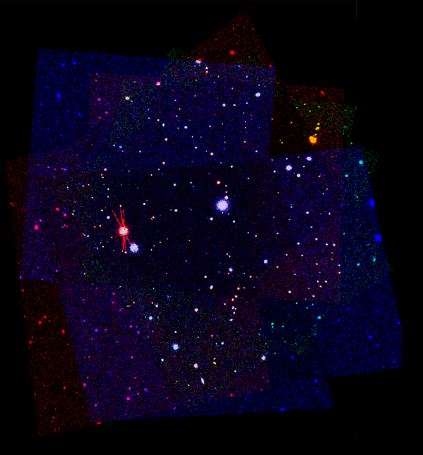

# SourceXtractor Tutorial

In this tutorial we assume you have installed SourceXtractor in some manner,
and that it is in your PATH environment. If it is not the case,
please have a look at [the documentation from the main project](https://github.com/astrorama/SourceXtractorPlusPlus/blob/develop/README.md)
and follow any of the installation procedures there.

## Data files
The FITS files are contained in this repository using [git lfs](https://git-lfs.github.com/). If you do not have `git-lfs` installed yet, you may either get the package from your Linux distribution (e.g., `sudo dnf install git-lfs` on Fedora distributions) or follow the instructions below:

```bash
mkdir -p ~/.local/bin
wget https://github.com/git-lfs/git-lfs/releases/download/v2.8.0/git-lfs-linux-amd64-v2.8.0.tar.gz
tar xzf git-lfs-linux-amd64-v2.8.0.tar.gz -C ~/.local/bin/
rm git-lfs-linux-amd64-v2.8.0.tar.gz
# If ~/.local/bin is not already in your path
export PATH="$PATH:$HOME/.local/bin"
```

Once `git lfs` is installed you may retrieve the tutorial and the FITS data with:

```bash
git clone https://github.com/astrorama/SourceXtractorTutorial
cd SourceXtractorTutorial
git lfs install
git lfs pull
```

Here is a colored version of the test images. You can clearly see there are
three bands, with three images each. It is also clearly visible that they are
not only rotated and shifted, but there is also a shear effect.



SourceXtractor uses the WCS headers of the images to do the necessary
transformations during measurement or model fitting.

## Tutorial

The tutorial includes three different configuration sets:

* [Detection on a coadded image](detection/README.md)
* [Aperture photometry on multiple frames](measurement/README.md)
* [Model fitting on multiple frames](modelfitting/README.md)
