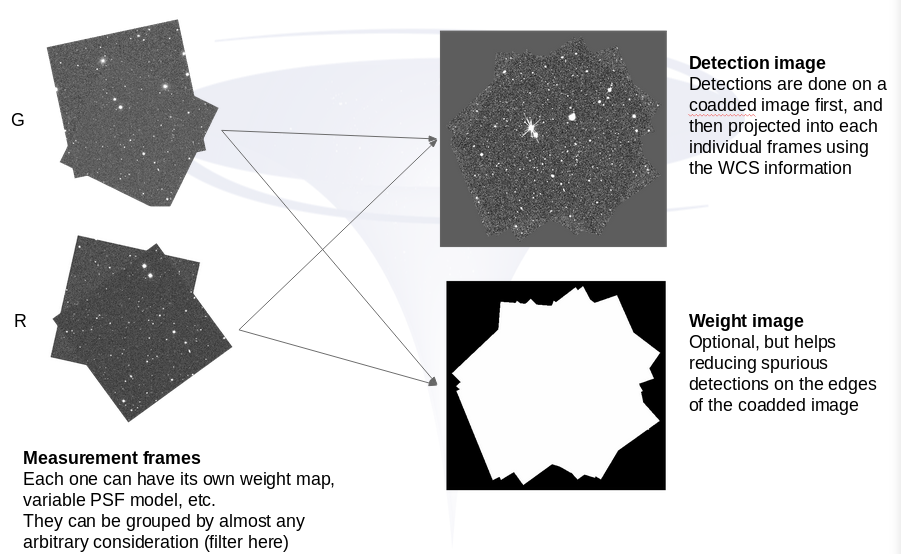

# Detection



SourceXtractor performs the detection on a single, coadded, image, which
can be created using, for instance, [SWarp](http://www.astromatic.net/software/swarp).

Later, position and shape can be projected into the individual measurement
frames whenever required. For more details on how does this work,
have a look at the [measurement](../measurement/README.md) example.

In this particular example - see [`detection.conf`](detection.conf) -,
SourceXtractor will perform the detections over the coadded image
`sim11.fits`, using the weight map `sim11.weight.fits`,
and writing the output into `detection_cat.fits`.

The settings used will be, mostly, the defaults, except for some parameters
worth mentioning:

* `partition-multithreshold=true` enables the partition of sources that are
  too close together, and are detected as one.
* `grouping-algorithm=SPLIT` tells SourceXtractor to group sources that were
  split previously. In this example, this is not particularly useful, but it
  becomes handy for model fitting, as it allows to fit multiple close sources
  at once, so the effect they each have in one another is taken into account.
* `use-cleaning=True` enables the removal of spurious sources detected on the
  edges of bright ones. It does so via a simpler model fitting, using
  a [Moffat profile](https://en.wikipedia.org/wiki/Moffat_distribution).
* `output-properties` SourceXtractor works on properties, not on columns. Each
  property may have on or more attributes that end being written into columns.
  You can check the supported properties via `sourcextractor++ --list-output-properties`.
  You can also have a look at the actual columns  with
  `sourcextractor++ --property-column-mapping-all`
* `check-image-*` The software can also generate FITS image useful for debugging
  itself, or the configuration. In this particular case, we are asking
  for images with the interpolated background, the variance map, the segmentation
  map (before partitioning and cleaning), the partition map (after partition and
  cleaning), and the grouping.
  These images include the WCS headers extracted from the underlying image (
  the coadded detection one, in this case)

To run this example:

```bash
sourcextractor++ --config-file detection.conf
```
