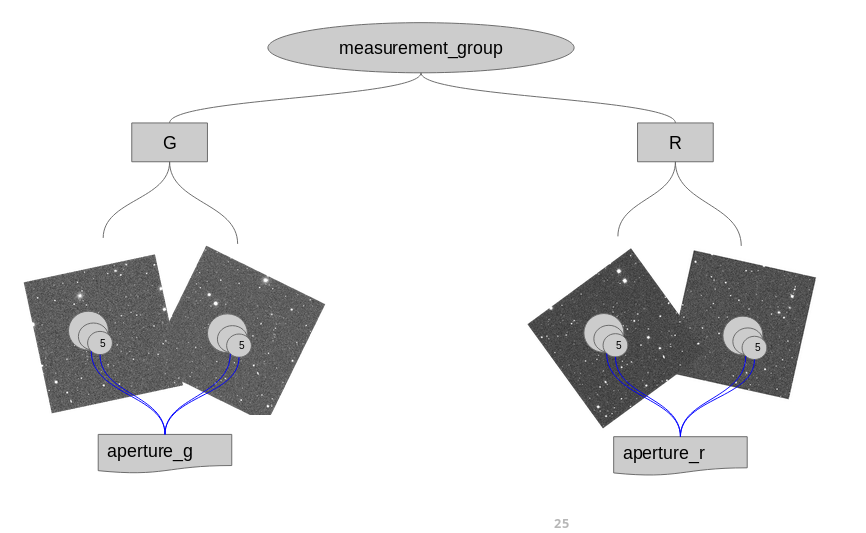
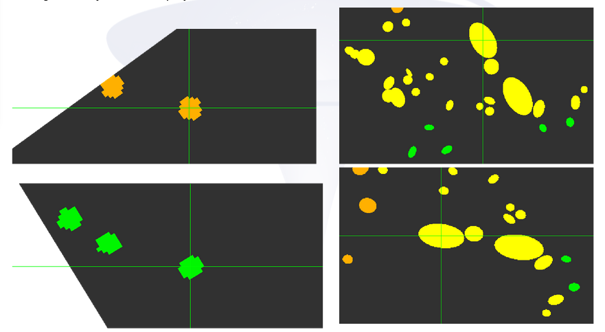

# Multiframe measurement

If you have already done the [detection](../detection.README.md)
exercise, most parameters from [`measurment.conf`](measurement.conf)
will look familiar. Except this one line:

```
python-config-file=measurement.py
```

Indeed, measurements in SourceXtractor are configured via a Python script.

The code [`measurement.py`](measurement.py) is commented, so it should be,
more or less, clear what it is doing.

At the end of the day, the configuration is "building" a tree like the following
(simplified, it lacks one band and one image per band, but the idea is the same):



`measurement_group` is the tree root, with one level based on the `FILTER`
keyword of the fits files. Three aperture photometries are set on each image,
and grouped per band into a single output column: `aperture_g`, `aperture_r`
and `aperture_i`.

You could have one single aperture column for all images if you wanted.
For instance:

```python
all_apertures = []
for band, imgs in measurement_group:
    # For each individual image within the band
    for img in imgs:
        # Measure the photometry with apertures of 5, 10 and 20 pixels on the detection frame of reference
        all_apertures.extend(add_aperture_photometry(img, [5, 10, 20]))
# All apertures
add_output_column('aperture', all_apertures)
```

## Aperture projection

For aperture photometries, the diameter is configured in pixels,
on the detection image.

Similarly, the shape for auto ([Kron](http://adsabs.harvard.edu/doi/10.1086/190669))
photometries is computed also on the detection image.

This means they have to be projected into the measurement images using the WCS
information. In the following image you can see:

* On the left, the circular aperture for the same sources, aligned
* On the right, the shape for the auto photometries, for the same sources,
  but respecting the original image orientation



You can get this images via the `check-image-aperture` and `check-image-auto-aperture`
settings. There will be one debug image generated per frame.

## Output dimensionality

We are configured one single column for multiple measures. This means that
the output column will be, necessarily, multidimensional.

If `add_aperture_photometry` returns a single object modeling
N apertures, and `all_apertures` contains M of these objects, the dimensionality
of each cell will be N columns x M rows.

Let's check! Run SourceXtractor

```bash
sourcextractor++ --config-file measurement.conf
```

And let's use Python to verify the shape of the columns. IPython can be
convenient to use:

```python
from astropy.table import Table
catalog=Table.read('measurement_cat.fits')
print(catalog['aperture_r_flux'].shape)
```

This snippet will print `(953, 3, 3)`: 953 objects found, with 3
images in the `r` band, and 3 apertures in each image.

Other generated columns for the `r` band will be:

* `aperture_r_flux_err`
* `aperture_r_mag`
* `aperture_r_mag_err`
* `aperture_r_flags`

All with the same shape.

For the flags, you can check their meaning with:

```python
print(sourcextractor.Flags.values)
```

It can be also used directly. For instance:

```python
outside_first_frame_filter = (
  catalog['aperture_r_flags'][:,0,0] & sourcextractor.Flags.OUTSIDE
).astype(bool)
first_frame = catalog[~outside_first_frame_filter]
```
